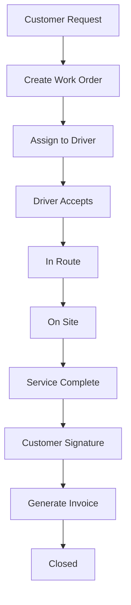

# RAW Disposal Business Implementation Plan

## Executive Summary
Complete implementation plan for RAW Disposal waste management business operations, including equipment rental, work order management, driver assignments, customer portal, and financial management systems.

## System Architecture Overview

### User Roles & Access Levels

#### 1. **Admin Users** (Full System Access)
- Complete CRUD operations on all entities
- Financial reporting and analytics
- System configuration and settings
- User management across all levels
- Invoice generation and management
- Equipment lifecycle management

#### 2. **Dispatchers** (Operations Management)
- Create and assign work orders
- Manage driver schedules and routes
- Track equipment status and location
- Handle emergency service requests
- Monitor daily operations dashboard
- Reassign work orders as needed

#### 3. **Managers** (Supervisory Access)
- Review operational reports
- Approve high-value transactions
- Manage team performance
- Handle escalated customer issues
- Access financial summaries
- Equipment maintenance scheduling

#### 4. **Drivers** (Field Operations)
- View assigned work orders via mobile app
- Update work order status in real-time
- Capture customer signatures
- Upload photos of equipment/service
- Add notes for admin/dispatcher
- Track mileage and time
- Complete equipment inspections

#### 5. **Customers** (Self-Service Portal)
- Submit equipment rental requests
- Track work order status
- View and pay invoices online
- Access service history
- Upload service request photos
- Manage account information
- Schedule recurring services

## Core System Components

### 1. Equipment Management System

#### Equipment Types (RAW Disposal Specific)
```php
enum EquipmentType: string
{
    // Waste Containers
    case DUMPSTER_10YD = 'dumpster_10yd';
    case DUMPSTER_20YD = 'dumpster_20yd';
    case DUMPSTER_30YD = 'dumpster_30yd';
    case DUMPSTER_40YD = 'dumpster_40yd';

    // Portable Sanitation
    case PORTABLE_TOILET_STANDARD = 'portable_toilet_standard';
    case PORTABLE_TOILET_DELUXE = 'portable_toilet_deluxe';
    case PORTABLE_TOILET_ADA = 'portable_toilet_ada';
    case HANDWASH_STATION_2 = 'handwash_station_2';
    case HANDWASH_STATION_4 = 'handwash_station_4';

    // Tanks
    case HOLDING_TANK_250 = 'holding_tank_250';
    case HOLDING_TANK_500 = 'holding_tank_500';
    case WATER_TANK_250 = 'water_tank_250';
    case WATER_TANK_500 = 'water_tank_500';
}
```

#### Equipment Status Tracking
- **Available**: Ready for rental/deployment
- **Reserved**: Scheduled for upcoming delivery
- **Rented**: Currently at customer location
- **In Transit**: Being delivered/picked up
- **Maintenance**: Under repair/service
- **Damaged**: Needs assessment/repair
- **Retired**: No longer in service

#### Equipment Features
- GPS tracking integration
- Maintenance schedule automation
- Rental history tracking
- QR code for quick identification
- Photo documentation system
- Condition assessment logs
- Service interval alerts

### 2. Work Order Management System

#### Work Order Types
- **Delivery**: Initial equipment drop-off
- **Pickup**: Equipment retrieval
- **Service**: Regular maintenance/cleaning
- **Exchange**: Swap equipment
- **Emergency**: Urgent service requests
- **Move**: Relocate equipment on-site

#### Work Order Workflow


#### Work Order Features
- Automated driver assignment based on:
  - Location proximity
  - Equipment type expertise
  - Current workload
  - Schedule availability
- Real-time status updates
- Photo capture requirements
- Digital signature collection
- GPS route optimization
- Service time tracking
- Notes and communication log

### 3. Customer Portal System

#### Portal Dashboard Components
- **Service Summary Widget**: Active rentals, pending requests
- **Invoice Overview**: Outstanding balances, payment history
- **Quick Actions**: Request service, pay invoice, schedule pickup
- **Equipment Status**: Current rentals with location/status
- **Service Calendar**: Scheduled services and deliveries
- **Document Center**: Contracts, invoices, receipts

#### Customer Self-Service Features
1. **Equipment Rental Request**
   - Browse available equipment catalog
   - Check availability by date
   - Select delivery/pickup dates
   - Add special instructions
   - Upload site photos
   - Request quote

2. **Service Management**
   - Schedule regular service
   - Request emergency service
   - Track service history
   - Rate service quality
   - Submit complaints/feedback

3. **Financial Management**
   - View invoices (using Tomato Invoices)
   - Make online payments
   - Set up autopay
   - Download statements
   - View payment history
   - Manage payment methods

4. **Communication Center**
   - Message dispatch/admin
   - Receive notifications
   - Service alerts
   - Invoice reminders

### 4. Driver Mobile Application

#### Driver Dashboard
```typescript
interface DriverDashboard {
  todayRoute: WorkOrder[];
  weekSchedule: WorkOrder[];
  equipmentInventory: Equipment[];
  notifications: Alert[];
  performance: {
    completedToday: number;
    onTimeRate: number;
    customerRating: number;
  };
}
```

#### Driver Workflow Features
1. **Daily Route Management**
   - View optimized route
   - Navigate to locations
   - Reorder stops if needed
   - Mark arrival/departure

2. **Work Order Execution**
   - View customer details
   - Access equipment information
   - Complete service checklist
   - Capture required photos:
     - Before service
     - After service
     - Equipment condition
     - Site conditions
   - Collect signatures
   - Add service notes

3. **Equipment Management**
   - Scan QR codes
   - Update equipment status
   - Report damage/issues
   - Track inventory

4. **Communication**
   - Message dispatcher
   - Call customer
   - Report emergencies
   - Request assistance

### 5. Financial Management System

#### Invoice System (Tomato Invoices Integration)
```php
// Custom implementation for RAW Disposal
class RawDisposalInvoiceService
{
    public function createRentalInvoice(WorkOrder $workOrder)
    {
        return FilamentInvoices::create()
            ->for($workOrder->customer)
            ->from($workOrder->company)
            ->dueDate(now()->addDays(30))
            ->items([
                InvoiceItem::make('Equipment Rental - ' . $workOrder->equipment->name)
                    ->qty($workOrder->rental_days)
                    ->price($workOrder->equipment->daily_rate),
                InvoiceItem::make('Delivery Fee')
                    ->qty(1)
                    ->price($workOrder->delivery_fee),
                InvoiceItem::make('Pickup Fee')
                    ->qty(1)
                    ->price($workOrder->pickup_fee),
            ])
            ->save();
    }
}
```

#### Payment Processing
- **Payment Methods**:
  - Credit/Debit cards (Stripe/Square)
  - ACH transfers
  - Check payments
  - Cash on delivery
  - Net terms (approved customers)

- **Automated Features**:
  - Recurring billing for regular service
  - Late payment reminders
  - Auto-charge for approved customers
  - Payment receipt generation
  - Account statement generation

#### Financial Reporting
- Daily revenue reports
- Equipment utilization rates
- Customer aging reports
- Driver performance metrics
- Route efficiency analysis
- Profit/loss by equipment type

### 6. Dispatch Management System

#### Dispatcher Dashboard
- **Live Operations Map**: Real-time driver/equipment locations
- **Work Order Queue**: Unassigned and pending orders
- **Driver Status Board**: Available, busy, break, offline
- **Equipment Availability**: Real-time inventory status
- **Alert Center**: Emergencies, delays, issues
- **Communication Hub**: Driver/customer messaging

#### Dispatch Features
1. **Intelligent Assignment**
   ```php
   class WorkOrderAssignmentService
   {
       public function autoAssign(WorkOrder $workOrder)
       {
           $drivers = $this->getAvailableDrivers();

           return $drivers->map(function($driver) use ($workOrder) {
               return [
                   'driver' => $driver,
                   'score' => $this->calculateScore($driver, $workOrder)
               ];
           })
           ->sortByDesc('score')
           ->first()['driver'];
       }

       private function calculateScore($driver, $workOrder)
       {
           $score = 0;
           $score += $this->proximityScore($driver, $workOrder);
           $score += $this->workloadScore($driver);
           $score += $this->equipmentExperienceScore($driver, $workOrder);
           $score += $this->customerHistoryScore($driver, $workOrder);
           return $score;
       }
   }
   ```

2. **Route Optimization**
   - Minimize travel distance
   - Consider traffic patterns
   - Group nearby services
   - Balance driver workload
   - Account for equipment capacity

3. **Emergency Response**
   - Priority queue for urgent requests
   - Nearest available driver alert
   - Customer notification system
   - Escalation procedures

### 7. Notification System

#### Notification Types
1. **Customer Notifications**
   - Service scheduled confirmation
   - Driver en route alert
   - Service completed notice
   - Invoice generated
   - Payment received
   - Payment reminder

2. **Driver Notifications**
   - New assignment
   - Route changes
   - Customer messages
   - Emergency alerts
   - Schedule reminders

3. **Admin/Dispatcher Notifications**
   - Emergency service requests
   - Equipment maintenance due
   - Driver delays/issues
   - Payment failures
   - Customer complaints

#### Notification Channels
- Email (SendGrid/Postmark)
- SMS (Twilio)
- Push notifications (mobile app)
- In-app notifications
- WhatsApp (optional)

## Implementation Phases

### Phase 1: Foundation (Week 1-2)
- [ ] Update EquipmentType enum with RAW Disposal types
- [ ] Install and configure Tomato Invoices plugin
- [ ] Create Filament resources for WasteCollection, WasteRoute, DisposalSite
- [ ] Set up user role permissions for Dispatcher and Manager
- [ ] Configure notification templates

### Phase 2: Customer Portal (Week 3-4)
- [ ] Build customer dashboard with React/Inertia
- [ ] Implement equipment rental request flow
- [ ] Integrate Tomato Invoices for customer invoice viewing
- [ ] Add online payment processing (Stripe/Square)
- [ ] Create service request management interface
- [ ] Implement customer notification preferences

### Phase 3: Driver Mobile App (Week 5-6)
- [ ] Enhance React Native app for RAW Disposal workflows
- [ ] Implement work order management interface
- [ ] Add photo capture and upload functionality
- [ ] Integrate digital signature collection
- [ ] Build offline mode with sync capabilities
- [ ] Add GPS tracking and route navigation

### Phase 4: Dispatch System (Week 7-8)
- [ ] Create dispatcher dashboard
- [ ] Implement intelligent work order assignment
- [ ] Build route optimization algorithm
- [ ] Add real-time tracking map
- [ ] Create emergency response workflow
- [ ] Implement driver communication system

### Phase 5: Financial Integration (Week 9-10)
- [ ] Customize Tomato Invoices for RAW Disposal
- [ ] Implement automated billing workflows
- [ ] Add payment gateway integrations
- [ ] Create financial reporting dashboards
- [ ] Set up recurring billing system
- [ ] Implement late payment automation

### Phase 6: Advanced Features (Week 11-12)
- [ ] Equipment maintenance scheduling automation
- [ ] Predictive analytics for equipment needs
- [ ] Customer portal mobile app
- [ ] API for third-party integrations
- [ ] Advanced reporting and analytics
- [ ] Performance optimization

## Database Schema Updates

### New/Updated Tables

```sql
-- Equipment rental pricing
CREATE TABLE equipment_rental_rates (
    id BIGSERIAL PRIMARY KEY,
    equipment_type VARCHAR(50),
    daily_rate DECIMAL(10,2),
    weekly_rate DECIMAL(10,2),
    monthly_rate DECIMAL(10,2),
    delivery_fee DECIMAL(10,2),
    pickup_fee DECIMAL(10,2),
    effective_date DATE,
    created_at TIMESTAMP,
    updated_at TIMESTAMP
);

-- Work order assignments
CREATE TABLE work_order_assignments (
    id BIGSERIAL PRIMARY KEY,
    work_order_id BIGINT REFERENCES work_orders(id),
    driver_id BIGINT REFERENCES drivers(id),
    assigned_at TIMESTAMP,
    accepted_at TIMESTAMP,
    started_at TIMESTAMP,
    completed_at TIMESTAMP,
    status VARCHAR(50),
    notes TEXT,
    created_at TIMESTAMP,
    updated_at TIMESTAMP
);

-- Customer portal sessions
CREATE TABLE customer_sessions (
    id BIGSERIAL PRIMARY KEY,
    customer_id BIGINT REFERENCES customers(id),
    token VARCHAR(255) UNIQUE,
    ip_address VARCHAR(45),
    user_agent TEXT,
    last_activity TIMESTAMP,
    expires_at TIMESTAMP,
    created_at TIMESTAMP
);

-- Equipment tracking
CREATE TABLE equipment_tracking (
    id BIGSERIAL PRIMARY KEY,
    equipment_id BIGINT REFERENCES equipment(id),
    latitude DECIMAL(10,8),
    longitude DECIMAL(11,8),
    status VARCHAR(50),
    battery_level INTEGER,
    last_ping TIMESTAMP,
    created_at TIMESTAMP
);
```

## API Endpoints

### Customer Portal API
```
POST   /api/customer/auth/login
POST   /api/customer/auth/logout
GET    /api/customer/dashboard
GET    /api/customer/equipment/available
POST   /api/customer/equipment/request
GET    /api/customer/work-orders
POST   /api/customer/work-orders
GET    /api/customer/invoices
POST   /api/customer/invoices/{id}/pay
GET    /api/customer/service-history
POST   /api/customer/support/ticket
```

### Driver Mobile API
```
POST   /api/driver/auth/login
GET    /api/driver/work-orders/today
GET    /api/driver/work-orders/week
PATCH  /api/driver/work-orders/{id}/status
POST   /api/driver/work-orders/{id}/photos
POST   /api/driver/work-orders/{id}/signature
POST   /api/driver/work-orders/{id}/notes
GET    /api/driver/equipment/scan/{qr_code}
PATCH  /api/driver/equipment/{id}/status
POST   /api/driver/location/update
```

### Dispatch API
```
GET    /api/dispatch/dashboard
GET    /api/dispatch/drivers/available
POST   /api/dispatch/work-orders/assign
GET    /api/dispatch/work-orders/unassigned
POST   /api/dispatch/routes/optimize
GET    /api/dispatch/tracking/live
POST   /api/dispatch/emergency/create
GET    /api/dispatch/analytics/daily
```

## Security Considerations

### Authentication & Authorization
- Multi-factor authentication for admin users
- Session timeout policies
- Role-based access control (RBAC)
- API rate limiting
- JWT token expiration

### Data Protection
- Encrypt sensitive customer data
- PCI compliance for payment processing
- GDPR compliance for data retention
- Regular security audits
- SSL/TLS for all communications

### Audit Trail
- Log all financial transactions
- Track user actions
- Record status changes
- Monitor API access
- Generate compliance reports

## Performance Optimization

### Database Optimization
- Index frequently queried columns
- Partition large tables by date
- Implement database connection pooling
- Use read replicas for reporting
- Cache frequently accessed data

### Application Performance
- Implement Redis caching
- Use queue workers for heavy tasks
- Optimize image uploads and storage
- Implement lazy loading
- Use CDN for static assets

### Mobile App Optimization
- Offline-first architecture
- Data synchronization strategies
- Image compression
- Minimize API calls
- Progressive web app option

## Testing Strategy

### Unit Testing
- Model validation tests
- Service class tests
- API endpoint tests
- Helper function tests
- Queue job tests

### Integration Testing
- Payment gateway integration
- SMS/Email delivery
- GPS tracking integration
- Third-party API tests
- Database transaction tests

### End-to-End Testing
- Customer portal workflows
- Driver app workflows
- Dispatch operations
- Payment processing
- Report generation

### Performance Testing
- Load testing for concurrent users
- API response time testing
- Database query optimization
- Mobile app performance
- Real-time tracking stress tests

## Monitoring & Maintenance

### System Monitoring
- Server health monitoring (New Relic/Datadog)
- Application error tracking (Sentry/Bugsnag)
- Database performance monitoring
- API response time tracking
- Queue worker monitoring

### Business Metrics
- Daily active users
- Equipment utilization rates
- Average response times
- Customer satisfaction scores
- Revenue per equipment type
- Driver efficiency metrics

### Maintenance Tasks
- Daily database backups
- Weekly security updates
- Monthly performance reviews
- Quarterly security audits
- Annual disaster recovery drills

## Success Metrics

### Operational KPIs
- Work order completion rate: >95%
- On-time delivery rate: >90%
- Equipment utilization: >70%
- Customer response time: <2 hours
- Driver productivity: 8-10 stops/day

### Financial KPIs
- Invoice collection rate: >95%
- Average days to payment: <30
- Revenue per customer: Track growth
- Equipment ROI: >150% annually
- Operating margin: >25%

### Customer Satisfaction KPIs
- Customer satisfaction score: >4.5/5
- Net Promoter Score (NPS): >50
- Customer retention rate: >85%
- Service complaint rate: <2%
- Portal adoption rate: >60%

## Support & Documentation

### User Documentation
- Admin user guide
- Dispatcher manual
- Driver app tutorial
- Customer portal guide
- API documentation

### Training Materials
- Video tutorials
- Interactive demos
- Quick reference cards
- FAQ documents
- Best practices guide

### Support Structure
- Tier 1: Customer service (portal/phone)
- Tier 2: Technical support
- Tier 3: Development team
- Emergency hotline for critical issues
- Knowledge base for self-service

## Future Enhancements

### Year 2 Roadmap
- AI-powered route optimization
- Predictive maintenance for equipment
- Customer mobile app (iOS/Android)
- Integration with accounting software
- Advanced analytics dashboard
- Multi-location support

### Innovation Opportunities
- IoT sensors for equipment monitoring
- Drone inspection capabilities
- Automated customer communications
- Machine learning for demand forecasting
- Blockchain for contract management
- Virtual reality training for drivers

## Risk Management

### Technical Risks
- **Risk**: System downtime
  - **Mitigation**: Redundant servers, automated failover
- **Risk**: Data loss
  - **Mitigation**: Real-time backups, disaster recovery plan
- **Risk**: Security breach
  - **Mitigation**: Regular audits, penetration testing

### Business Risks
- **Risk**: Driver shortage
  - **Mitigation**: Driver pool management, contractor network
- **Risk**: Equipment damage/loss
  - **Mitigation**: GPS tracking, insurance coverage
- **Risk**: Payment failures
  - **Mitigation**: Multiple payment gateways, collection procedures

### Compliance Risks
- **Risk**: Environmental regulations
  - **Mitigation**: Compliance tracking, regular training
- **Risk**: Data privacy violations
  - **Mitigation**: GDPR compliance, data protection policies
- **Risk**: Safety incidents
  - **Mitigation**: Safety protocols, regular training

## Budget Considerations

### Development Costs
- Phase 1-2: $30,000 - $40,000
- Phase 3-4: $35,000 - $45,000
- Phase 5-6: $25,000 - $35,000
- Total estimate: $90,000 - $120,000

### Ongoing Costs (Monthly)
- Server hosting: $500 - $1,000
- Third-party services: $800 - $1,200
- Maintenance & support: $2,000 - $3,000
- Total monthly: $3,300 - $5,200

### ROI Expectations
- Operational efficiency: 30% improvement
- Customer acquisition: 25% increase
- Revenue growth: 40% year-over-year
- Cost reduction: 20% in manual processes
- Payback period: 12-18 months

## Conclusion

This comprehensive implementation plan provides a complete roadmap for building a fully functional RAW Disposal business management system. The phased approach ensures systematic development while maintaining operational continuity. The integration of existing systems with new features like the Tomato Invoices plugin creates a robust, scalable solution that addresses all stakeholder needs.

Key success factors:
1. Strong foundation with existing Laravel/Filament infrastructure
2. Phased implementation minimizing disruption
3. Focus on user experience across all interfaces
4. Comprehensive testing and quality assurance
5. Scalable architecture for future growth

The system will transform RAW Disposal operations, providing real-time visibility, improved efficiency, and enhanced customer satisfaction while positioning the business for sustainable growth.